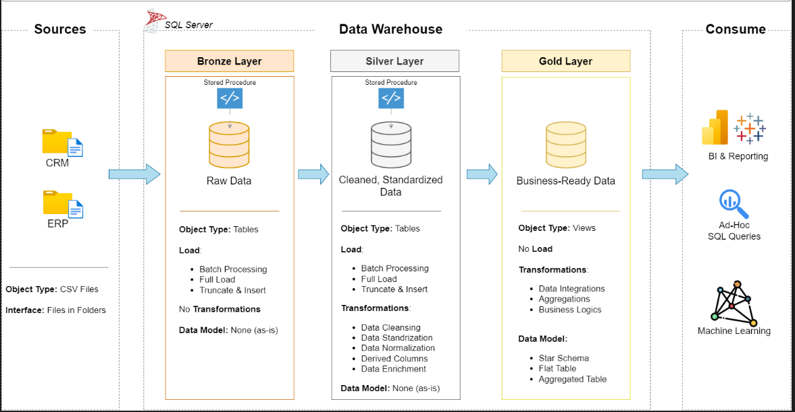

# 📊 Data Warehouse & Analytics Project

Welcome to the **Data Warehouse and Analytics Project** repository! 🚀  
This portfolio project demonstrates a complete data warehousing and analytics solution—from raw data ingestion to business-ready insights. It follows industry best practices in **data engineering**, **ETL**, and **analytics**.

---

## 🏗️ Data Architecture Overview

This project uses the **Medallion Architecture**, which organizes data into three layers:

1. **Bronze Layer**  
   - Raw data ingested from CSV files  
   - Stored in SQL Server without transformation

2. **Silver Layer**  
   - Cleansed and standardized data  
   - Includes normalization and business logic

3. **Gold Layer**  
   - Final analytical layer  
   - Star schema with dimension and fact views for reporting

---

## 📖 Project Highlights

This project includes:

- ✅ Modern Data Architecture using Bronze, Silver, and Gold layers  
- 🔄 ETL Pipelines to extract, transform, and load data from ERP and CRM sources  
- 🧠 Data Modeling with optimized fact and dimension tables  
- 📈 SQL-Based Analytics for insights into customer behavior, product performance, and sales trends

### 💼 Skills Demonstrated
- SQL Development  
- Data Engineering  
- ETL Pipeline Design  
- Data Modeling  
- Business Intelligence & Reporting  

---

## 🛠️ Tools & Resources

All tools used are free and accessible:

- 📁 **Datasets**: CSV files used in the project  
- 🗄️ SQL Server Express  
- 🧠 [SQL Server Management Studio (SSMS)](https://learn.microsoft.com/en-us/sql/ssms/download-sql-server-management-studio-ssms?view=sql-server-ver16)  
- 🧰 GitHub  
- 🧩 DrawIO  
- 📋 Notion  
- 📌 Notion Project Steps

---

## 🚀 Project Goals

### 🔧 Data Engineering

**Objective**: Build a modern data warehouse using SQL Server to consolidate and prepare sales data for analysis.

** a unified analytical model  
- Focus on current data (no historization)  
- Document the data model for business and analytics teams

---

### 📊 Data Analysis & Reporting

**Objective**: Generate actionable insights using SQL-based analytics.

**Focus Areas**:
- Customer behavior analysis  
- Product performance tracking  
- Sales trend evaluation  

These insights support strategic decision-making for stakeholders.

---

